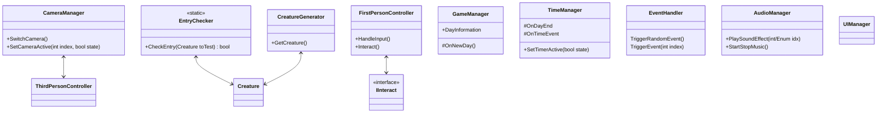

```mermaid

classDiagram
        CameraManager <--> ThirdPersonController
		EntryChecker <--> Creature
		CreatureGenerator <--> Creature
		FirstPersonController <--> IInteract

        class GameManager{
            +DayInformation
            #OnNewDay()
        }
		
		class FirstPersonController{
			+HandleInput()
			+Interact()
		}
	
		class IInteract{
			<<interface>>
		}

		class CameraManager{
			+SwitchCamera()
			+SetCameraActive(int index, bool state)
		}

		class TimeManager{
			+SetTimerActive(bool state)
			#OnDayEnd
			#OnTimeEvent
		}

        class CreatureGenerator{
	        +GetCreature()
        }
    
        class EventHandler{
	        TriggerRandomEvent()
	        TriggerEvent(int index)
        }
		
		class AudioManager{
			+PlaySoundEffect(int/Enum idx)
			+StartStopMusic()
		}
		
		class UIManager{
		}

		class EntryChecker{
			<<static>>
			+CheckEntry(Creature toTest) bool
		}

		class Creature{
		}
```